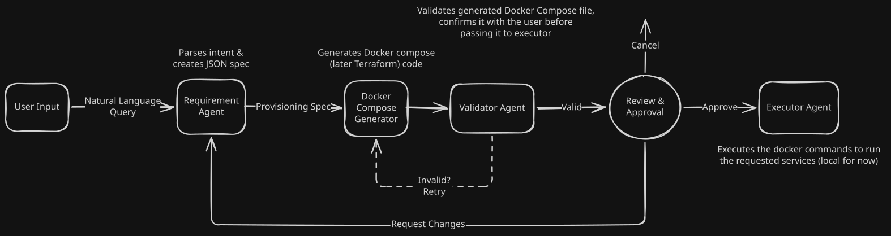

# InfraPilot

AI agent that converts natural language into a working Docker environment, validates it, and provisions it locally.

## Usage

```bash
python main.py "I need a FastAPI backend with PostgreSQL and Redis"
```

## Pipeline

1. **Requirement Agent** - Creates a requirement spec based on the user query
2. **Docker Generator Agent** - generates docker compose file from the requirement spec
3. **Validation Agent** - validates the generated docker compose
4. **Human Approval** - Confirm from the user if the generated docker compose matches the user's requirement, additionally provide the option to make further changes which will forward it to Requirement Agent
5. **Execution Agent** - Upon user's approval, run `docker compose up -d` to up the services



### Future Plans:
- Frontend UI for a simple dashboard for demonstration
- Instead of running docker services locally, run the commands remotely (maybe have an option to define the endpoints for Docker Engine API?)
- Change the scope from Docker to a IaC like Terraform
